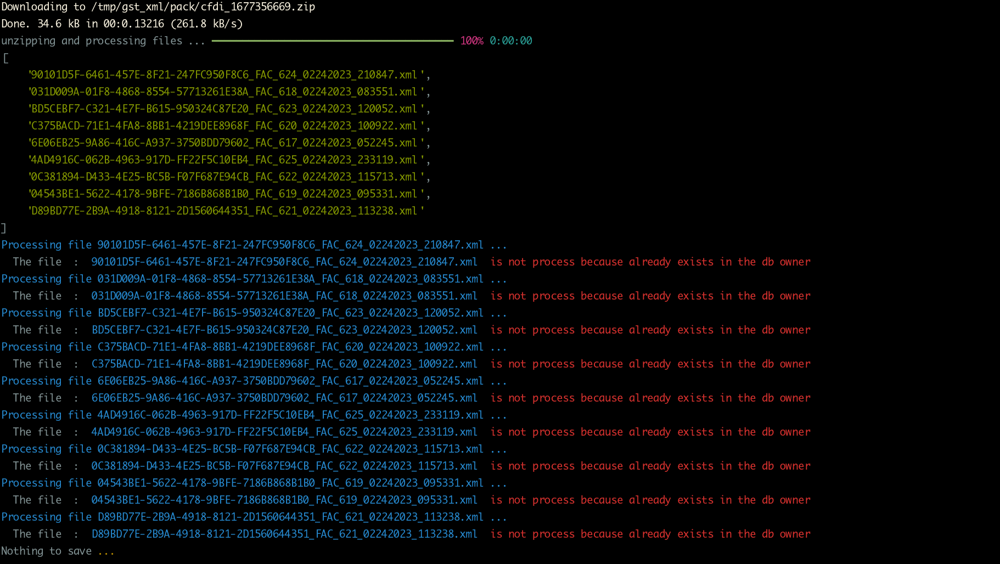
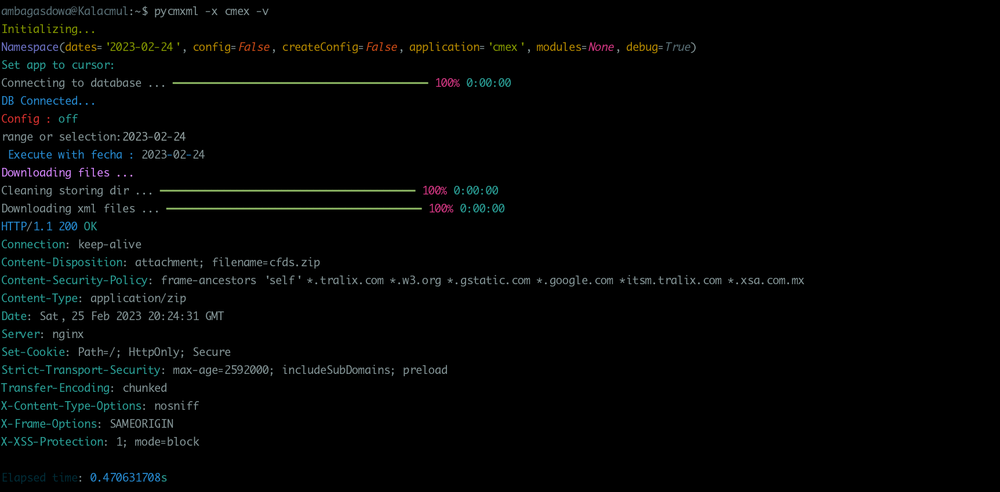
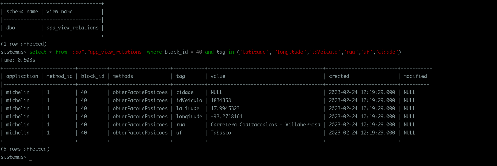

# pycmxml

This is a small utility for download xml zipped from a repository and store in a database

# Install

```bash
git clone https://github.com/ambagasdowa/pycmxml.git
python3 -m pip install pycmxml
```

OR

```bash
python3 -m pip install git+https://github.com/ambagasdowa/pycmxml.git
```

for a specific branch or tag add with @

```bash
 python3 -m pip install git+https://github.com/ambagasdowa/pycmxml.git@v3.1.4
```

# Config

put a config.ini file under config user dir

> in dir ~/.config/config.ini

edit according to your needs

```ini
[DEFAULT]
    app = pycmxml
    author = Jesus Baizabal
    mail = baizabal.jesus@gmail.com
    url = baizabal.xyz
    github = https://github.com/ambagasdowa
[db_connection]
    #Ip for the server
    server= 127.0.0.1
    driver= ODBC Driver 17 for SQL Server
    database= dbname
    user= my_usr
    password= my_pass
[download_config]
    #voucher service provider: tralix
    #? is reeplaced by token string
    token: xxxxxxxxx-xxxxx-xxxx-xxxx-xxxxxxxxxxxx
    http_path: [url]:[port]/[?=token]/someFile
    download_path: /tmp/
    dir_path: gst_xml/
    # ? is reeplaced by a unique number tag
    filename: cfdi_?.zip
[service_params]
    # can be [XML,PDF,ACUSE]
    representacion: XML
    #[0-100] defaults 50
    pageSize: 100
    # same as params default is ? that means:yesterday
    fecha: '2022-12-06:2022-12-12'
    #        fecha: '2022-12-06'
    # Next params are not implemented
    # fechaInicial => yyy-mm-dd | ? take argument from command line
    fechaInicial: ?
    fechaFinal: ?
    serie: ''
    # int
    folioEspecifico: ''
    folioInicial: ''
    folioFinal: ''
    # 2d340db1-9c08-4c97-9ca8-676dc648094e
    uuid: ''
[apps]
    # Active applications
    michelin=true
    cmex=true
[michelin]
    # michelin geopositions service
    url: http://sasintegra.sascar.com.br/SasIntegra/SasIntegraWSService?wsdl
    # headers:{content-type: 'application/soap+xml'}
    headers: {content-type: 'text/xml'}
    xtension : xml
    # Add methods for request to WS
    # and need to add the xml-template for the body of request
    methods : obterPacotePosicoes,obterVeiculos

```

# Usage

pycmxml --help

```bash
usage: pycmxml [-h] [-d DATES] [-c] [-cc] [-x APPLICATION] [-m MODULES] [-v]

Small utility to download zipped xml files and parse contents to a db

optional arguments:
  -h, --help            show this help message and exit
  -d DATES, --dates DATES
                        Set the date for process files inputs can be --dates={[date:range] , [date0,date1] or [date]} (default: yesterday)
  -c, --config          Takes dates from configuration values
  -cc, --createConfig   Create configuration files in ~/.config/pycmxml/config.ini
  -x APPLICATION, --application APPLICATION
                        Set the application to execute [cmex, michelin ]
  -m MODULES, --modules MODULES
                        Set the modules to run for get data from api ws , use whith --application params, and get entry as module1,module2,...
  -v, --debug           Set the debug output to true
```

# Example

> dates : set the date for process files inputs can be --dates={[date:range] , [date0,date1] or [date]} (default: yesterday)')

get a range of dates

```bash
  pycmxml -x cmex --dates='2022-12-01:2022-12-15'
```

read dates from config.py

```bash
  pycmxml --config -x cmex
```

# Set application

pycmxml -x app

# Todo

- [x] Build functions for print messages and hide them
- [ ] Set an option for trigger the last procedure in cmex
- [ ] Automatize the database installation
- [ ] Add a rest-api {fastapi}
- [ ] Build a Dashboard for data visualization { web , dash }

# Some Pictures

### Get a Soap Response


### Download zipped xml files for proccessing



### Proccessing unziped files


### Verbose output



### Save and proccess xml responses


### Data in databse


